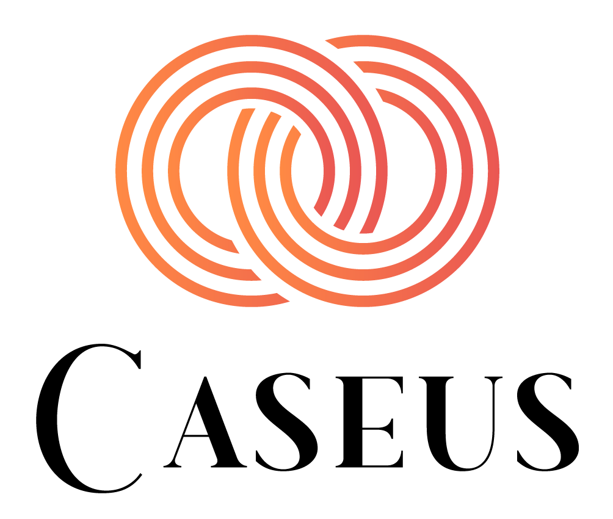

# CASEUS

_Une application de gestion administrative d'une entreprise_

##  1.  Table des matières
<!-- vscode-markdown-toc -->
1. [Table des matières](#Table)
2. [Présentation du projet et objectifs](#Pres)
3. [Outils et technologies utilisés](#Outils)
4. [Consignes d’installation](#Consignes)
5. [Sources et contact des auteurs](#Sources)

<!-- vscode-markdown-toc-config
	numbering=true
	autoSave=true
	/vscode-markdown-toc-config -->
<!-- /vscode-markdown-toc -->

##  2. Présentation du projet et objectifs
Notre projet « Caseus » est une application web ayant pour objectif de faciliter les tâches administratives pour les employés d’une entreprise. Elle permet aux employés de gérer efficacement leurs informations personnelles, de suivre leurs congés et absences, d’échanger un jour de travail et de consulter leurs horaires. Elle offre également aux managers une vue globale de l’activité de leur équipe et leur permet de prendre des décisions éclairées. Il y a 3 catégories d’employés dans l’entreprise : les employés polyvalents, les assistants manager et les managers.
En somme, l’application vise à améliorer la productivité et la communication au sein de l’entreprise.

##  3. Outils et technologies utilisés
Afin de créer une application web efficace et fonctionnelle nous avons fait le choix d’utiliser les outils et technologies suivants :
- PHP 7 : utilisé pour développer la partie serveur de l’application et gérer les interactions avec la base de données.
- Design Patterns : Data Access Object (DAO) et Singleton.
- HTML, CSS et JavaScript : utilisés pour développer l’interface utilisateur et la
présentation des données.
- MySQL : utilisé pour stocker et récupérer les données de l’application, comme les informations sur les employés, les congés, les absences...
- Git : utilisé pour gérer les différentes versions du code et faciliter la collaboration entre les développeurs. Aussi utilisé comme outil de gestion de projet (GitLab). (Template utilisé pour la gestion de projet : @V.Deslandres et [YoanDev](https://yoandev.co))
- Méthode agile « Scrum » : utilisée pour gérer le développement du projet de manière efficace et flexible. Elle nous a par ailleurs permis de nous adapter aux changements d’objectifs en cours de projet et de prioriser les tâches importantes. Elle offre également une amélioration continue grâce à des itérations régulières. Enfin, elle nous a permis de maintenir une communication efficace.

##  4. Consignes d’installation
Consignes d’installation pour éditer et visualiser le projet « Caseus » :
1. Assurez-vous d’avoir les prérequis nécessaires : une version stable de PHP 7 et un environnement de développement web ; ex. : Visual Studio Code ou PhpStorm.
2. Depuis cette page, téléchargez le projet ou forkez le.
3. Installez sur votre machine un serveur web local (Xampp,Mamp...) comprenant un système de gestion de SGBD (phpMyAdmin par exemple).
4. Importez le jeu de données fourni « ./Diagrammes d'analyse et de conception/jeu_donnees.sql » dans phpMyAdmin en utilisant l’outil d’import.
5. Configurez le fichier « ./Code/config/configuration.php » pour relier votre base de données à l’application.
6. Accédez à l’application enutilisant l’URL de votre serveur web (après vous être assuré que tous ses services fonctionnent) sur votre navigateur.

##  5. Sources et contact des auteurs
- Gestion de l’envoi des mails : EmailJS - https://www.emailjs.com
- Problèmes rencontrés avec PHP (très utile pour la gestion des dates/heures) : PHP - https://www.php.net
- Icônes : Fontawesome - https://fontawesome.com
- Images d’illustration : Unsplash - https://unsplash.com/fr

Si vous rencontrez des problèmes lors de l’installation ou de la manipulation du projet, veuillez contacter l’équipe de développement pour obtenir de l'aide :
- [AGHUMYAN Mesrop](@p2103901) (mesrop.aghumyan@etu.univ-lyon1.fr)
- [BORIE Yanis](@p2100107) (yanis.borie@etu.univ-lyon1.fr)
- [COURTET Tom](@p2101495) (tom.courtet@etu.univ-lyon1.fr)
- [CURVAT Elliot](@p2020739) (elliot.curvat@etu.univ-lyon1.fr)
